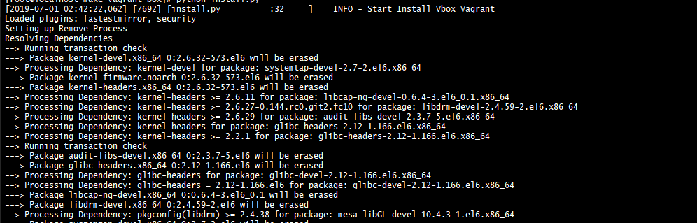
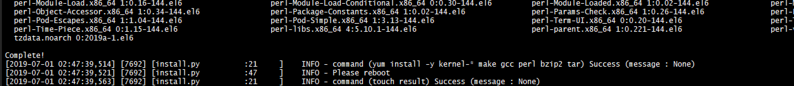
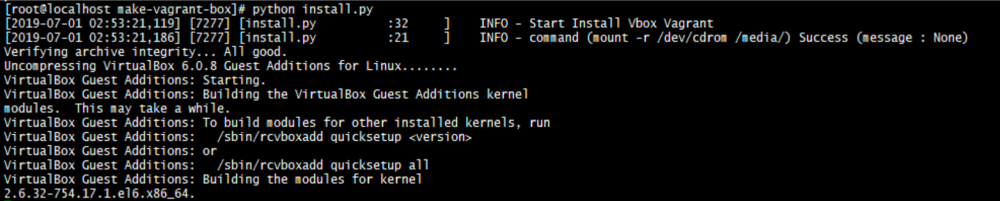

# vagrant-make-box

VirtualBox와 Vagrant 조합으로 사용하는 환경에서 Vagrant Box를 만들기 전, 필요한 내부 설정을 하기 위한 스크립트이다. 커널 패치 및 VirtualBox Guest Addition 설치 등을 수행하며 간단하게 수행하는 것을 목표로 한다.

## 사용 방법
1. 스크립트 적용 전, 가상머신에 VirtualBox GuestAddition ISO 파일을 CD로 등록한다. (사용 중인 VirtualBox 버전에 맞춰서 등록)
- VirtualBox GuestAddition 다운로드 사이트 ([VirtualBox GuestAddition 다운로드 링크](https://download.virtualbox.org/virtualbox/))

2. 적용 스크립트 실행
```
python install.py
```


3. 커널 패치 후 시스템 재시작
```
reboot
```


4. 재시작 후, 스크립트 다시 실행
```
python install.py
```


5. 정상 설치되었으면, 종료 후 Vagrant 패키지

## 참고 사이트
1. [Vagrant BASE Box 만들기(CentOS 7)](https://blog.asamaru.net/2015/10/14/creating-a-vagrant-base-box/)